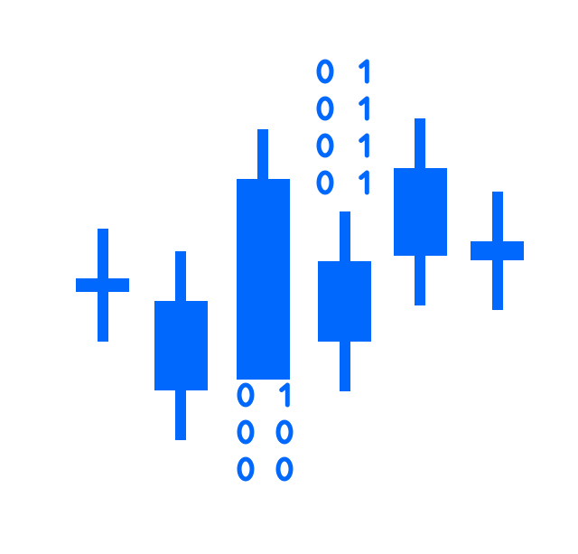
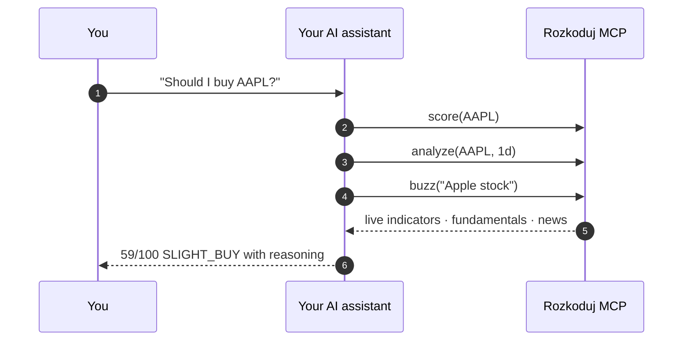

<div align="center">

<picture>
  <source media="(prefers-color-scheme: dark)" srcset="docs/assets/logo-dark.svg">
  
</picture>

# Rozkoduj MCP - Decode the Markets

Screening, analysis, and scoring across stocks, crypto, and forex - right inside your AI assistant.

<br>

[](https://cursor.com/en/install-mcp?name=rozkoduj&config=eyJuYW1lIjoicm96a29kdWoiLCJ0eXBlIjoiaHR0cCIsInVybCI6Imh0dHBzOi8vbWNwLnJvemtvZHVqLmNvbS9tY3AifQ==)
[](https://vscode.dev/redirect/mcp/install?name=rozkoduj&config=%7B%22type%22%3A%22http%22%2C%22url%22%3A%22https%3A//mcp.rozkoduj.com/mcp%22%7D)

[](https://github.com/rozkoduj/rozkoduj-mcp/actions)
[](https://pypi.org/project/rozkoduj-mcp/)
[](https://python.org)
[](https://codecov.io/gh/rozkoduj/rozkoduj-mcp)
[](LICENSE)

</div>

> [!TIP]
> ### Just ask
>
> - *"Score AAPL - should I buy?"*
> - *"What are today's hidden gems in crypto?"*
> - *"Full analysis of NVDA - technicals, fundamentals, and news"*
> - *"Is the market risk-on or risk-off right now?"*

## Quick start

Add the hosted server URL to your MCP client:

```
https://mcp.rozkoduj.com/mcp
```

No API key. No setup. Works immediately.

<details>
<summary><b>Cursor</b></summary>

Add to `~/.cursor/mcp.json`:

```json
{
  "mcpServers": {
    "rozkoduj": {
      "url": "https://mcp.rozkoduj.com/mcp"
    }
  }
}
```
</details>

<details>
<summary><b>VS Code</b></summary>

Add to `.vscode/mcp.json`:

```json
{
  "servers": {
    "rozkoduj": {
      "type": "http",
      "url": "https://mcp.rozkoduj.com/mcp"
    }
  }
}
```
</details>

<details>
<summary><b>Claude Code</b></summary>

```bash
claude mcp add rozkoduj --transport http https://mcp.rozkoduj.com/mcp
```
</details>

<details>
<summary><b>Claude Desktop</b></summary>

Add to `claude_desktop_config.json`:

```json
{
  "mcpServers": {
    "rozkoduj": {
      "type": "http",
      "url": "https://mcp.rozkoduj.com/mcp"
    }
  }
}
```
</details>

<details>
<summary><b>Self-hosted (PyPI / Docker)</b></summary>

```bash
pip install rozkoduj-mcp       # from PyPI
uvx rozkoduj-mcp               # or run directly
docker run -p 8080:8080 $(docker build -q .)  # Docker
```
</details>

## How it works

You ask in plain language. The AI picks the right tools. You get an answer with evidence - not a data dump.



Same pattern works for any market question:

| You ask                              | You get                                                              |
| ------------------------------------ | -------------------------------------------------------------------- |
| *"Should I buy AAPL?"*               | 0-100 verdict combining technical, fundamental, and sentiment        |
| *"Decode NVDA - full picture."*      | 3-D analysis (1d/4h/1W TA + fundamentals + news), one final verdict  |
| *"Hidden gems in crypto today?"*     | Ranked anomalies - volume spikes, RSI extremes, big moves, 52W breaks |
| *"Do timeframes agree on TSLA?"*     | 15m / 1h / 4h / 1d / 1W side-by-side with alignment score            |
| *"Find oversold bounce in EU."*      | Filtered list: RSI < 30 + MACD bullish cross                         |
| *"What's the market mood?"*          | RISK-ON / RISK-OFF + fear & greed + VIX + upcoming events            |
| *"Any buzz around Tesla?"*           | Attention level + fresh headlines from major sources                 |

## Tools

### Find opportunities

| Tool | What it does |
| ---- | ------------ |
| `digest` | Scans all global markets and surfaces anomalies ranked by 1-5 star surprise score. Volume spikes, RSI extremes, big moves, 52-week highs/lows - with fundamental context for each gem. |
| `scan` | Custom screening with any combination of filters, columns, and sorting. 30+ indicators and fundamental metrics. |
| `smart_screen` | One-word preset screens: `unusual_volume`, `oversold_bounce`, `breakout`, `momentum`, `value`, `dividend`, `growth`. |
| `movers` | Top gainers and losers with quality filters. |

### Analyze a symbol

| Tool | What it does |
| ---- | ------------ |
| `decode` | Full 3-dimensional analysis: technical (daily, 4h, weekly), fundamental (valuation, analysts, earnings), and news sentiment. Each dimension scored 0-100, combined into a single verdict. |
| `score` | Quick 0-100 score combining technical rating, momentum, volume quality, and trend strength. |
| `analyze` | Detailed technical analysis: RSI, MACD, Bollinger Bands, ADX, and 30+ indicators on any timeframe. |
| `fundamentals` | Valuation (P/E, P/B, EV/EBITDA), quality scores (Piotroski, Altman Z), analyst consensus, earnings dates, dividends. |
| `compare` | Side-by-side technical analysis for up to 10 symbols. |
| `multitf` | Multi-timeframe alignment scoring across 15m, 1h, 4h, 1d, 1W. |

### Read the market

| Tool | What it does |
| ---- | ------------ |
| `market_pulse` | Market regime: fear & greed indices + VIX = RISK-ON, RISK-OFF, or NEUTRAL. |
| `buzz` | News attention signal for any ticker in any language. |
| `calendar` | Upcoming economic events with actual vs forecast vs previous. |

<details>
<summary><b>Resources & Prompts</b></summary>

| Type | Name | Description |
| ---- | ---- | ----------- |
| Resource | `rozkoduj://markets` | Available markets with IDs |
| Resource | `rozkoduj://fields` | Screening fields by category |
| Resource | `rozkoduj://operators` | Filter operators for scan |
| Prompt | `morning_briefing` | Daily overview: regime, movers, calendar |
| Prompt | `deep_dive(symbol)` | Full analysis: all tools combined |
| Prompt | `find_opportunities(market)` | Multi-screen opportunity scan |

</details>

## Example prompts

**"Should I buy?"**
```
Score AAPL - should I buy?
Decode NVDA - full 3D analysis with news
Compare AAPL, MSFT, GOOGL - which one looks best?
```

**"What's interesting today?"**
```
What are today's market anomalies? Any hidden gems?
Find unusual volume stocks in crypto.
Show me oversold bounce candidates in European markets.
```

**"What's going on?"**
```
Is the market risk-on or risk-off right now?
What economic events are happening this week?
Is there any buzz around Tesla?
```

## Coverage

20+ markets worldwide. Symbols are auto-detected - `BTCUSDT` routes to crypto, `AAPL` to US stocks, `EURUSD` to forex.

## License

MIT - [rozkoduj.com](https://rozkoduj.com)
